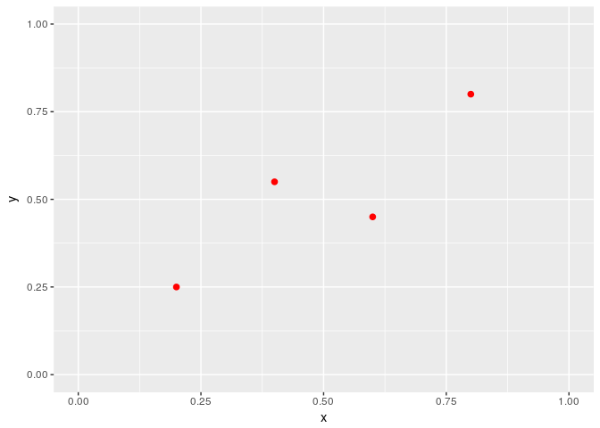
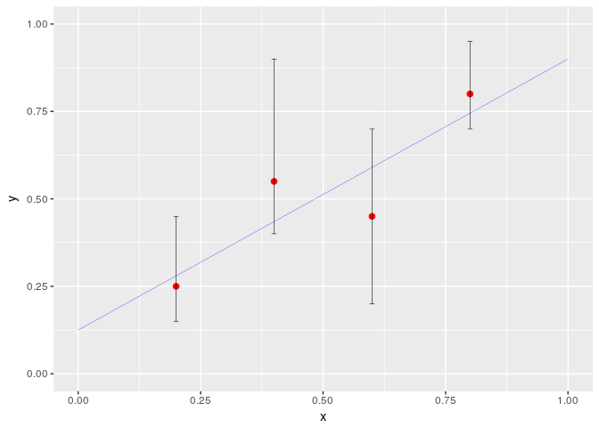
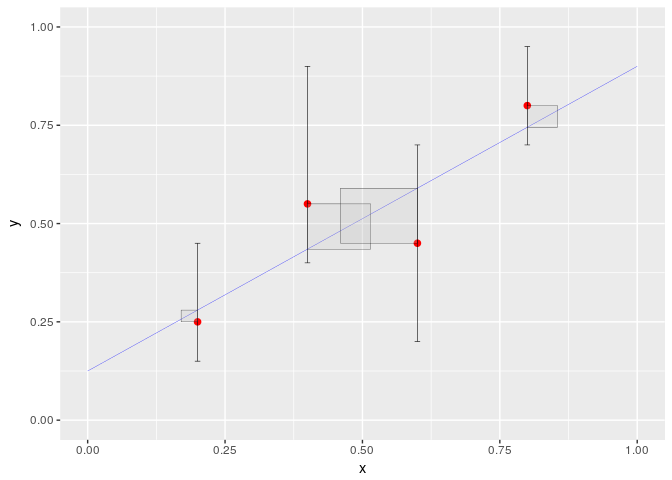
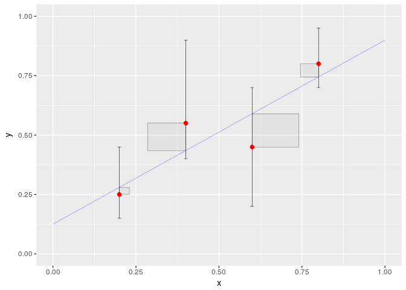
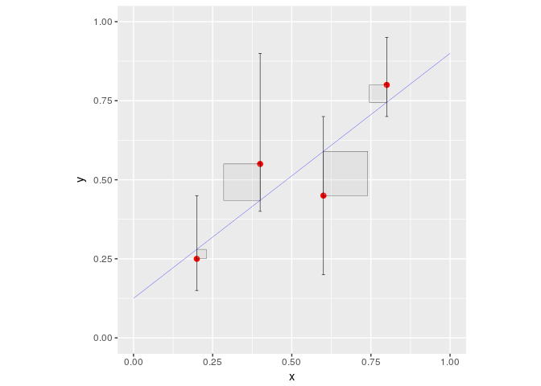

Least Squares method illustration
================

### The illustration of the "Least Squares" method I wish somebody would show to me when I was 10 years old.

...or how to make it so obvious that you will never forget what it means.

The task is actually very simple, we need to visualize the 'squares' in such an obvious way that you would never ask "what squares?" again. But first we need some 'data'. When you need 'data' you pull it straigh out of your... typed in table of 'experimental points' (with individual 'error margins'), here's a simple way to do it:

``` r
h <- read.delim(textConnection(
"t x xmi xma y ymi yma
0 0.2 0.15 0.5 0.25 0.15 0.45
1 0.4 0.25 0.5 0.55 0.4 0.9
2 0.6 0.4 0.65 0.45 0.2 0.7
3 0.8 0.6 0.9 0.8 0.7 0.95"), 
sep=" ")

a <- c(0.6); b <- c(0.2)  # These are the 'wild guesses' of the linear model coefficients (see below)
```

We will start plotting right away; let's load ggplot, set the data source and the size of the plot as a first step.

``` r
require(ggplot2)
```

    ## Loading required package: ggplot2

``` r
p <- ggplot(data = h, mapping = aes(x = x, xmin = 0, 
                                    xmax = 1, 
                                    ymin = 0, 
                                    ymax = 1),
            legend = TRUE)
```

Now we plot the (x,y) points and look at the picture for the first time (with the help of 'print()').

``` r
p <- p + geom_point(mapping = aes(x = x, y = y), 
                                  size = 2, 
                                  color = "red")
print(p)
```



Let's add the error bars too.

``` r
p <- p + geom_errorbar(mapping = aes(x = x, 
                                     ymin = ymi, 
                                     ymax = yma), 
                                  size = 0.2, 
                                  width = 0.01, 
                                  color = "black")
print(p)
```


Now our 'wild guess' function f of x with our handmade parameters a and b entered together with the data on step one.

``` r
fxab <- function(x) a*x + b  # this is the function

p0 <- p + stat_function(fun = fxab, 
                       size = 0.1, 
                       color = "blue")
print(p0)
```


Cute. But we are supposed to demonstrate the "Least Squares" fitting of the so called "linear model". In R it's a single line of code:

``` r
fxlm <- lm( y ~ x, h) # this line, fits the modey y~x to data h
```

Then we just rewrite the initial parameters a and b

``` r
b <- as.numeric(coef(fxlm)[1]); a <- as.numeric(coef(fxlm)[2])

# And plot the fitted line instead of our 'wild guess'

p <- p + stat_function(fun = fxab, 
                       size = 0.1, 
                       color = "blue")
print(p)
```



Now let's work out the 'squares' themself. We can draw them in two ways: directed towards the line of the function or away from it. We will try both and see what is better, but for plotting them we will (unfortunately) need an 'inverse function' - x(y); but that is simple if the original function is a linear dependence.

``` r
fyab <- function(y) y/a - b/a
```

Now let's do some head scratching, drawing lines and points on a piece of paper in order to figure out the conditions, and, finally, plot the 'squares'/rectangles.

``` r
p1 <- p + geom_rect(mapping = aes(xmin = ifelse(fyab(y) < x, 
                                        x - abs(fxab(x) - y), x), 
                                 xmax = ifelse(fyab(y) < x, 
                                        x, x + abs(fxab(x) - y)), 
                                 ymin = ifelse(fxab(x) < y, 
                                        y - abs(fxab(x) - y), y), 
                                 ymax = ifelse(fxab(x) < y, 
                                        y, y + abs(fxab(x) - y))),
                   alpha = 0.2, 
                   size = 0.1, 
                   color = "black", 
                   fill = "grey")
print(p1)
```



They are not exactly 'squares' here, the are literally rectangles, but we will deal with it later, right now I would like to try plotting them pointing away from the line.

``` r
p2 <- p + geom_rect(mapping = aes(xmin = ifelse(fyab(y) < x, x, 
                                        x - abs(fxab(x) - y)), 
                                 xmax = ifelse(fyab(y) < x, 
                                        x + abs(fxab(x) - y), x), 
                                 ymin = ifelse(fxab(x) < y, 
                                        y - abs(fxab(x) - y), y), 
                                 ymax = ifelse(fxab(x) < y, 
                                        y, y + abs(fxab(x) - y))),
                   alpha = 0.2, 
                   size = 0.1, 
                   color = "black", 
                   fill = "grey")
print(p2)
```



I think I like this one better... As you can see, we don't need to decide, just make two versions and choose later if you don't know yet.

And finally, if we fix the aspect ratio of the plot the rectangles will become squares and you will see the final illustration.

``` r
p2 <- p2 + coord_fixed(ratio = 1)
print(p2)
```



If you are like me (and many other people) and can in your mind imagine the parts of the picture moving, you immediatelly get an idea of how the whole method works. If you start moving or tilting the line, the squares (and their area) will be changing in a certain way. The name of the game is to make the sum of all their areas as small as possible. Remember that the bigger the side of the square already is - the faster its area changes if you increase it a bit (and the faster it decreases if you make the side of the square smaller)... Just play with this picture in your mind for a little while. I wish somebody would have shown it to me when I was 10 years old and I would be able to do it then.

The end.
--------
